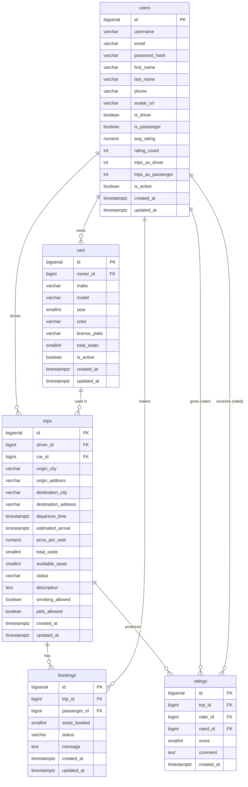

# Carpooling System – Database Schema

Managed by Flyway. Migrations live in `db/migration/`. Never edit an applied migration — always add a new versioned file. Hibernate runs with `ddl-auto: validate`.

---

## Tables

### `users`
Central identity and profile table. Stores authentication credentials (bcrypt `password_hash` only — never plaintext), contact info, and aggregated statistics (`avg_rating`, `rating_count`, `trips_as_driver`, `trips_as_passenger`) that are updated by the application after each completed trip or rating. A user can be a driver, a passenger, or both via the `is_driver` / `is_passenger` flags. Soft-deleted via `is_active`.

### `cars`
Vehicles registered by users who intend to drive. `owner_id` references `users`. `license_plate` is unique across the whole system. `total_seats` represents the number of passenger seats available (not counting the driver). Soft-deleted via `is_active`.

### `trips`
A single offered ride from `origin_city` to `destination_city`. `driver_id` and `car_id` reference the driver and the car used. `available_seats` is decremented when bookings are approved and must satisfy `0 <= available_seats <= total_seats`. `status` follows the lifecycle `SCHEDULED -> ACTIVE -> COMPLETED` or can be `CANCELLED` at any point. Optional free-text `description` plus preference flags (`smoking_allowed`, `pets_allowed`).

### `bookings`
A passenger's request to join a trip. The combination `(trip_id, passenger_id)` is unique — one booking record per passenger per trip. `seats_booked` must be >= 1. `status` transitions: `PENDING -> APPROVED | REJECTED`, or `CANCELLED` by the passenger. Cascades are intentionally omitted on the FK so a trip cannot be deleted while bookings exist (default RESTRICT behaviour).

### `ratings`
Post-trip ratings between any two participants. The triple `(trip_id, rater_id, rated_id)` is unique, preventing duplicate ratings for the same trip pairing. `score` is constrained to 1–5. After insertion the application updates `avg_rating` and `rating_count` on the `users` row for `rated_id`.

---

## ER Diagram

---

## Migration history

| Version | File                          | Summary                                      |
|---------|-------------------------------|----------------------------------------------|
| V1      | V1__create_users_table.sql    | `users` table with auth, profile, stats      |
| V2      | V2__create_cars_table.sql     | `cars` table owned by users                  |
| V3      | V3__create_trips_table.sql    | `trips` table with status/seats constraints  |
| V4      | V4__create_bookings_table.sql | `bookings` table with unique trip+passenger  |
| V5      | V5__create_ratings_table.sql  | `ratings` table with 1-5 score constraint    |
| V6      | V6__create_indexes.sql        | Indexes on all FK and search columns         |
| V7      | V7__seed_test_data.sql        | 2 users, 1 car, 1 trip, 1 booking (dev seed) |
